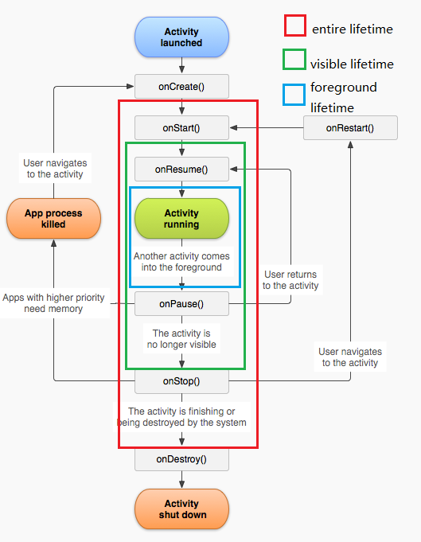

Java基本语法、面向对象相关的基本概念与思想<br/>
常用String类的api<br/>
异常处理<br/>
IO基础<br/>
容器<br/>
多线程<br/>
内存管理与垃圾回收<br/>
知道并最好知道几种常见的 Java 设计模式<br/>

Android基础UI控件的熟练掌握<br/>
(Button、TextView、EditText、CheckBox、RadioButton、ImageView、Spinner、ProgressBar、SeekBar、ListView、RecycleView、ScrollView)

## Activity的生命周期<br/>


```
public class Activity extends ApplicationContext {  
       //创建Activity
       public void onCreate(Bundle savedInstanceState) {
               super.onCreate(savedInstanceState);
           }
       //Activity快要变成可见的
           @Override
           protected void onStart() {
               super.onStart();
           }
       //Activity变成可见的，处于运行状态
           @Override
           protected void onResume() {
               super.onResume();
           }
       //其他Activity获得用户焦点，（Activity快要暂停了）
           @Override
           protected void onPause() {
               super.onPause();
           }
       //Activity不再可见，处于停止状态
           @Override
           protected void onStop() {
               super.onStop();
           }
       //Activity快要被销毁了
           @Override
           protected void onDestroy() {
               super.onDestroy()；
          ｝    
         // 重新获得可见
       protected void onRestart(){
            super.onRestart();
       };  
         
   }  
```
Activity的四种启动模式:startan<br/>
> 分别为standard，singleTop，singleTask，singleInstance。如果要使用这四种启动模式，
必须在manifest文件中<activity>标签中的launchMode属性中配置  
standard
标准启动模式，也是activity的默认启动模式。在这种模式下启动的activity可以被多次实例化，
即在同一个任务中可以存在多个activity的实例，每个实例都会处理一个Intent对象。
如果Activity A的启动模式为standard，并且A已经启动，在A中再次启动Activity A，
即调用startActivity（new Intent（this，A.class）），会在A的上面再次启动一个A的实例，即当前的桟中的状态为A-->A。
singleTop
如果一个以singleTop模式启动的activity的实例已经存在于任务桟的桟顶，那么再启动这个Activity时，不会创建新的实例，
而是重用位于栈顶的那个实例，并且会调用该实例的onNewIntent()方法将Intent对象传递到这个实例中。
举例来说，如果A的启动模式为singleTop，并且A的一个实例已经存在于栈顶中，
那么再调用startActivity（new Intent（this，A.class））启动A时，不会再次创建A的实例，而是重用原来的实例，并且调用原来实例的onNewIntent()方法。
这是任务桟中还是这有一个A的实例。
如果以singleTop模式启动的activity的一个实例已经存在与任务桟中，但是不在桟顶，那么它的行为和standard模式相同，也会创建多个实例。
singleTask
谷歌的官方文档上称，如果一个activity的启动模式为singleTask，那么系统总会在一个新任务的最底部（root）启动这个activity，
并且被这个activity启动的其他activity会和该activity同时存在于这个新任务中。如果系统中已经存在这样的一个activity则会重用这个实例，
并且调用他的onNewIntent()方法。即，这样的一个activity在系统中只会存在一个实例。
其实官方文档中的这种说法并不准确，启动模式为singleTask的activity并不会总是开启一个新的任务。
singleInstance
总是在新的任务中开启，并且这个新的任务中有且只有这一个实例，也就是说被该实例启动的其他activity会自动运行于另一个任务中。
当再次启动该activity的实例时，会重用已存在的任务和实例。并且会调用这个实例的onNewIntent()方法，将Intent实例传递到该实例中。
和singleTask相同，同一时刻在系统中只会存在一个这样的Activity实例。


## Fragment的生命周期

fragment的生命周期<br/>


Fragment与Activity之间的关系<br/>
  

1. 当一个fragment被创建的时候，它会经历以下状态.

onAttach()
onCreate()
onCreateView()
onActivityCreated()
2. 当这个fragment对用户可见的时候，它会经历以下状态。

onStart()
onResume()
3. 当这个fragment进入“后台模式”的时候，它会经历以下状态。

onPause()
onStop()
4. 当这个fragment被销毁了（或者持有它的activity被销毁了），它会经历以下状态。

onPause()
onStop()
onDestroyView()
onDestroy() // 本来漏掉类这个回调，感谢xiangxue336提出。
onDetach()
5. 就像activitie一样，在以下的状态中，可以使用Bundle对象保存一个fragment的对象。

onCreate()
onCreateView()
onActivityCreated()
6. fragments的大部分状态都和activitie很相似，但fragment有一些新的状态。

onAttached() —— 当fragment被加入到activity时调用（在这个方法中可以获得所在的activity）。
onCreateView() —— 当activity要得到fragment的layout时，调用此方法，fragment在其中创建自己的layout(界面)。
onActivityCreated() —— 当activity的onCreated()方法返回后调用此方法
onDestroyView() —— 当fragment中的视图被移除的时候，调用这个方法。
onDetach() —— 当fragment和activity分离的时候，调用这个方法。
一旦activity进入resumed状态（也就是running状态），你就可以自由地添加和删除fragment了。
因此，只有当activity在resumed状态时，fragment的生命周期才能独立的运转，其它时候是依赖于activity的生命周期变化的。


## BroadcastReceiver
> 面是Android Doc中关于BroadcastReceiver的概述：
  ①广播接收器是一个专注于接收广播通知信息，并做出对应处理的组件。很多广播是源自于系统代码的──比如，
  通知时区改变、电池电量低、拍摄了一张照片或者用户改变了语言选项。应用程序也可以进行广播──比如说，
  通知其它应用程序一些数据下载完成并处于可用状态。
  ②应用程序可以拥有任意数量的广播接收器以对所有它感兴趣的通知信息予以响应。所有的接收器均继承自BroadcastReceiver基类。
  ③广播接收器没有用户界面。然而，它们可以启动一个activity来响应它们收到的信息，或者用NotificationManager来通知用户。
  通知可以用很多种方式来吸引用户的注意力──闪动背灯、震动、播放声音等等。
  一般来说是在状态栏上放一个持久的图标，用户可以打开它并获取消息。
Android中的广播事件有两种，一种就是系统广播事件，比如：ACTION_BOOT_COMPLETED（系统启动完成后触发），
ACTION_TIME_CHANGED（系统时间改变时触发），ACTION_BATTERY_LOW（电量低时触发）等等。另外一种是我们自定义的广播事件。
广播事件的流程
  ①注册广播事件：注册方式有两种，一种是静态注册，就是在AndroidManifest.xml文件中定义，注册的广播接收器必须要继承BroadcastReceiver；
  另一种是动态注册，是在程序中使用Context.registerReceiver注册，注册的广播接收器相当于一个匿名类。两种方式都需要IntentFIlter。
  ②发送广播事件：通过Context.sendBroadcast来发送，由Intent来传递注册时用到的Action。
  ③接收广播事件：当发送的广播被接收器监听到后，会调用它的onReceive()方法，
  并将包含消息的Intent对象传给它。onReceive中代码的执行时间不要超过5s，否则Android会弹出超时dialog。
### BroadcastReceiver 的广播类型与不同的注册方式的区别

注册BroadcastReceiver有两种方式:

静态注册：在AndroidManifest.xml中用标签生命注册，并在标签内用标签设置过滤器。
```
    <receiver android:name="myRecevice">    //继承BroadcastReceiver，重写onReceiver方法
    
        <intent-filter>    
        
            <action android:name="com.dragon.net"></action> //使用过滤器，接收指定action广播
        
        </intent-filter>
    
    </receiver> 
```
    

动态注册：
```
    IntentFilter intentFilter = new IntentFilter();
    
    intentFilter.addAction(String);   //为BroadcastReceiver指定action，使之用于接收同action的广播
    
    registerReceiver(BroadcastReceiver,intentFilter);
    
    一般：在onStart中注册，onStop中取消unregisterReceiver
    指定广播目标Action：Intent intent = new Intent(actionString);
    并且可通过Intent携带消息 :intent.putExtra("msg", "hi,我通过广播发送消息了");
    发送广播消息：Context.sendBroadcast(intent )
```


## ContentProvider

## Service的使用场景与具体用法

#### service的种类

##### 按运行地点分类：

类别|	区别|	 优点|	缺点| 	 应用
---|---|---|---|---
本地服务（Local）|	该服务依附在主进程上，|	 服务依附在主进程上而不是独立的进程，这样在一定程度上节约了资源，另外Local服务因为是在同一进程因此不需要IPC，也不需要AIDL。相应bindService会方便很多|。	 主进程被Kill后，服务便会终止。|	 非常常见的应用如：HTC的音乐播放服务，天天动听音乐播放服务。
远程服务（Remote）|	该服务是独立的进程，|	 服务为独立的进程，对应进程名格式为所在包名加上你指定的android:process字符串。由于是独立的进程，因此在Activity所在进程被Kill的时候，该服务依然在运行，不受其他进程影响，有利于为多个进程提供服务具有较高的灵活性。	| 该服务是独立的进程，会占用一定资源，并且使用AIDL进行IPC稍微麻烦一点。	 |一些提供系统服务的Service，这种Service是常驻的。
其实remote服务还是很少见的，并且一般都是系统服务。

  

##### 按运行类型分类：

类别	|区别|	应用
---|---|---
前台服务|	会在通知一栏显示 ONGOING 的 Notification，|	当服务被终止的时候，通知一栏的 Notification 也会消失，这样对于用户有一定的通知作用。常见的如音乐播放服务。
后台服务|	默认的服务即为后台服务，即不会在通知一栏显示 ONGOING 的 Notification。|	当服务被终止的时候，用户是看不到效果的。某些不需要运行或终止提示的服务，如天气更新，日期同步，邮件同步等。
有同学可能会问，后台服务我们可以自己创建 ONGOING 的 Notification 这样就成为前台服务吗？答案是否定的，前台服务是在做了上述工作之后需要调用 startForeground （ android 2.0 及其以后版本 ）或 setForeground （android 2.0 以前的版本）使服务成为 前台服务。这样做的好处在于，当服务被外部强制终止掉的时候，ONGOING 的 Notification 任然会移除掉。

 

##### 按使用方式分类：

类别|区别
---|---
startService 启动的服务|	主要用于启动一个服务执行后台任务，不进行通信。停止服务使用stopService
bindService 启动的服务|	该方法启动的服务要进行通信。停止服务使用unbindService
startService 同时也 bindService 启动的服务	停止服务应同时使用stepService与unbindService


##### Service和Thread的关系
Service和Thread之间没有任何关系！
Service其实是运行在主线程里的.
1). Thread：Thread 是程序执行的最小单元，它是分配CPU的基本单位。可以用 Thread 来执行一些异步的操作。
2). Service：Service 是android的一种机制，当它运行的时候如果是Local Service，那么对应的 Service 是运行在主进程的 main 线程上的。
如：onCreate，onStart 这些函数在被系统调用的时候都是在主进程的 main 线程上运行的。
如果是Remote Service，那么对应的 Service 则是运行在独立进程的 main 线程上。因此请不要把 Service 理解成线程，它跟线程半毛钱的关系都没有！
既然这样，那么我们为什么要用 Service 呢？其实这跟 android 的系统机制有关，我们先拿 Thread 来说。
Thread 的运行是独立于 Activity 的，也就是说当一个 Activity 被 finish 之后，
如果你没有主动停止 Thread 或者 Thread 里的 run 方法没有执行完毕的话，Thread 也会一直执行。
因此这里会出现一个问题：当 Activity 被 finish 之后，你不再持有该 Thread 的引用。另一方面，你没有办法在不同的 Activity 中对同一 Thread 进行控制。
举个例子：如果你的 Thread 需要不停地隔一段时间就要连接服务器做某种同步的话，该 Thread 需要在 Activity 没有start的时候也在运行。
这个时候当你 start 一个 Activity 就没有办法在该 Activity 里面控制之前创建的 Thread。
因此你便需要创建并启动一个 Service ，在 Service 里面创建、运行并控制该 Thread，
这样便解决了该问题（因为任何 Activity 都可以控制同一 Service，而系统也只会创建一个对应 Service 的实例）。
因此你可以把 Service 想象成一种消息服务，而你可以在任何有 Context 的地方调用 
Context.startService、Context.stopService、Context.bindService，Context.unbindService，来控制它，
你也可以在 Service 里注册 BroadcastReceiver，在其他地方通过发送 broadcast 来控制它，当然这些都是 Thread 做不到的。

##### Service的生命周期
      onCreate　　onStart　　onDestroy　　onBind       
      1). 被启动的服务的生命周期：如果一个Service被某个Activity 调用 Context.startService 方法启动，
      那么不管是否有Activity使用bindService绑定或unbindService解除绑定到该Service，该Service都在后台运行。
      如果一个Service被startService 方法多次启动，那么onCreate方法只会调用一次，onStart将会被调用多次（对应调用startService的次数），
      并且系统只会创建Service的一个实例（因此你应该知道只需要一次stopService调用）。该Service将会一直在后台运行，
      而不管对应程序的Activity是否在运行，直到被调用stopService，或自身的stopSelf方法。当然如果系统资源不足，android系统也可能结束服务。
      2). 被绑定的服务的生命周期：如果一个Service被某个Activity 调用 Context.bindService 方法绑定启动，
      不管调用 bindService 调用几次，onCreate方法都只会调用一次，同时onStart方法始终不会被调用。
      当连接建立之后，Service将会一直运行，除非调用Context.unbindService 断开连接或者之前调用bindService 的 Context 不存在了
      （如Activity被finish的时候），系统将会自动停止Service，对应onDestroy将被调用。
      3). 被启动又被绑定的服务的生命周期：如果一个Service又被启动又被绑定，则该Service将会一直在后台运行。
      并且不管如何调用，onCreate始终只会调用一次，对应startService调用多少次，Service的onStart便会调用多少次。
      调用unbindService将不会停止Service，而必须调用 stopService 或 Service的 stopSelf 来停止服务。
      4). 当服务被停止时清除服务：当一个Service被终止（1、调用stopService；2、调用stopSelf；3、不再有绑定的连接（没有被启动））时，
      onDestroy方法将会被调用，在这里你应当做一些清除工作，如停止在Service中创建并运行的线程。
      特别注意：
      1、你应当知道在调用 bindService 绑定到Service的时候，你就应当保证在某处调用 unbindService 解除绑定
      （尽管 Activity 被 finish 的时候绑定会自　　　　　　动解除，并且Service会自动停止）；
      2、你应当注意 使用 startService 启动服务之后，一定要使用 stopService停止服务，不管你是否使用bindService； 
      3、同时使用 startService 与 bindService 要注意到，Service 的终止，需要unbindService与stopService同时调用，
      才能终止 Service，不管 startService 与 bindService 的调用顺序，如果先调用 unbindService 此时服务不会自动终止，
      再调用 stopService 之后服务才会停止，如果先调用 stopService 此时服务也不会终止，
      而再调用 unbindService 或者 之前调用 bindService 的 Context 不存在了（如Activity 被 finish 的时候）之后服务才会自动停止；
      4、当在旋转手机屏幕的时候，当手机屏幕在“横”“竖”变换时，此时如果你的 Activity 如果会自动旋转的话，
      旋转其实是 Activity 的重新创建，因此旋转之前的使用 bindService 建立的连接便会断开（Context 不存在了），对应服务的生命周期与上述相同。
      5、在 sdk 2.0 及其以后的版本中，对应的 onStart 已经被否决变为了 onStartCommand，不过之前的 onStart 任然有效。
      这意味着，如果你开发的应用程序用的 sdk 为 2.0 及其以后的版本，那么你应当使用 onStartCommand 而不是 onStart。  
      
##### 在什么情况下使用 startService 或 bindService 或 同时使用startService 和 bindService
 如果你只是想要启动一个后台服务长期进行某项任务那么使用 startService 便可以了。
 如果你想要与正在运行的 Service 取得联系，那么有两种方法，一种是使用 broadcast ，另外是使用 bindService ，
 前者的缺点是如果交流较为频繁，容易造成性能上的问题，并且 BroadcastReceiver 本身执行代码的时间是很短的（也许执行到一半，后面的代码便不会执行），
 而后者则没有这些问题，因此我们肯定选择使用 bindService（这个时候你便同时在使用 startService 和 bindService 了，
 这在 Activity 中更新 Service 的某些运行状态是相当有用的）。另外如果你的服务只是公开一个远程接口，
 供连接上的客服端（android 的 Service 是C/S架构）远程调用执行方法。这个时候你可以不让服务一开始就运行，而只用 bindService ，
 这样在第一次 bindService 的时候才会创建服务的实例运行它，这会节约很多系统资源，特别是如果你的服务是Remote Service，
 那么该效果会越明显（当然在 Service 创建的时候会花去一定时间，你应当注意到这点）。  
 
##### 在 AndroidManifest.xml 里 Service 元素的常见选项
      
      android:name　　-------------　　服务类名
      android:label　　--------------　　服务的名字，如果此项不设置，那么默认显示的服务名则为类名
      android:icon　　--------------　　服务的图标
      android:permission　　-------　　申明此服务的权限，这意味着只有提供了该权限的应用才能控制或连接此服务
      android:process　　----------　　表示该服务是否运行在另外一个进程，如果设置了此项，那么将会在包名后面加上这段字符串表示另一进程的名字
      android:enabled　　----------　　如果此项设置为 true，那么 Service 将会默认被系统启动，不设置默认此项为 false
      android:exported　　---------　　表示该服务是否能够被其他应用程序所控制或连接，不设置默认此项为 false

## 动画相关也是必须掌握的，不管是矢量动画还是属性动画的api都应该熟练，一些简单的动画应该随手就能写出来才行。

## 自定义View

## Sqlite与SQL语句

常见的数据格式与解析方法得了解吧，虽然目前常用的数据格式就是json，解析库也有很多，如Gson、Jackson、Fastjson等。

## 网络编程相关的基础知识要掌握
http协议相关
http method<br/>
##### status code
状态代码有三位数字组成，第一个数字定义了响应的类别，且有五种可能取值：
1xx：指示信息--表示请求已接收，继续处理
2xx：成功--表示请求已被成功接收、理解、接受
3xx：重定向--要完成请求必须进行更进一步的操作
4xx：客户端错误--请求有语法错误或请求无法实现
5xx：服务器端错误--服务器未能实现合法的请求
常见状态代码、状态描述、说明：
200 OK      //客户端请求成功
400 Bad Request  //客户端请求有语法错误，不能被服务器所理解
401 Unauthorized //请求未经授权，这个状态代码必须和WWW-Authenticate报头域一起使用 
403 Forbidden  //服务器收到请求，但是拒绝提供服务
404 Not Found  //请求资源不存在，eg：输入了错误的URL
500 Internal Server Error //服务器发生不可预期的错误
503 Server Unavailable  //服务器当前不能处理客户端的请求，一段时间后可能恢复正常
eg：HTTP/1.1 200 OK （CRLF）  

request & response<br/>
http cache<br/>
request header<br/>
params<br/>
试着用 HttpUrlConnection 封装一个网络库<br/>
